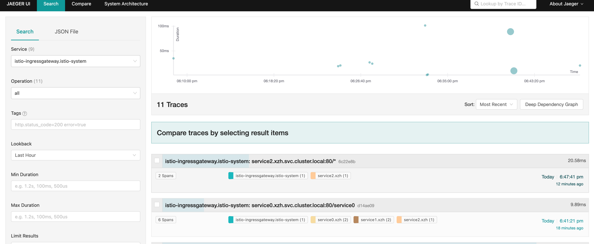
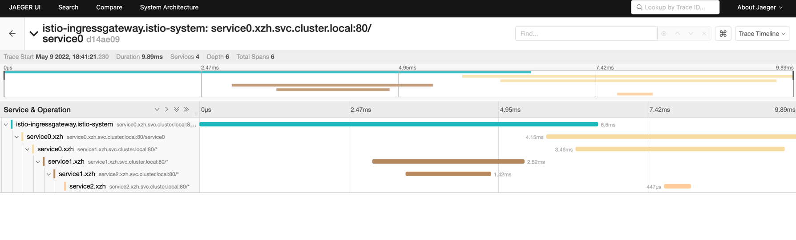
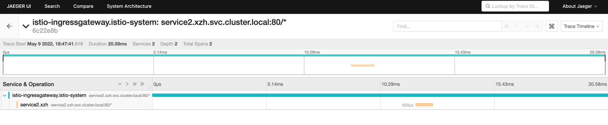

### 1、Create ns and inject istio
```shell
dream@k8s0:~/yaml/istio/homework$ kubectl create ns xzh
namespace/xzh created

dream@k8s0:~/yaml/istio/homework$ kubectl label ns xzh istio-injection=enabled
namespace/xzh labeled
```

### 2、Generate cert
```shell
dream@k8s0:~/yaml/istio/homework$ openssl req -x509 -sha256 -nodes -days 365 -newkey rsa:2048 -subj '/O=xzh Inc./CN=*.xzh.io' -keyout xzh.io.key -out xzh.io.crt
Generating a RSA private key
...................+++++
....................+++++
writing new private key to 'xzh.io.key'
-----
```

### 3、Create credential
```shell
dream@k8s0:~/yaml/istio/homework$ kubectl create -n istio-system secret tls xzh-credential --key=xzh.io.key --cert=xzh.io.crt
secret/xzh-credential created
```

### 4、Deploy jaeger
```shell
kubectl apply -f jaeger.yaml
kubectl edit configmap istio -n istio-system
set tracing.sampling=100
```

### 5、deploy service
```shell
dream@k8s0:~/yaml/istio/homework$ kubectl -n xzh apply -f service0.yaml 
deployment.apps/service0 created
service/service0 created
dream@k8s0:~/yaml/istio/homework$ kubectl -n xzh apply -f service1.yaml 
deployment.apps/service1 created
service/service1 created
dream@k8s0:~/yaml/istio/homework$ kubectl -n xzh apply -f service2.yaml 
deployment.apps/service2 created
service/service2 created
```

### 6、Apply gateway
```shell
dream@k8s0:~/yaml/istio/homework$ kubectl -n xzh apply -f istio-specs-tracing.yaml 
virtualservice.networking.istio.io/service0 created
gateway.networking.istio.io/service0 created

dream@k8s0:~/yaml/istio/homework$ kubectl -n xzh apply -f istio-specs-https.yaml 
virtualservice.networking.istio.io/httpsserver created
gateway.networking.istio.io/httpsserver created
```

### 7、Check tracing
```shell
dream@k8s0:~/yaml/istio/homework$ curl 10.20.62.12/service0 -v 
*   Trying 10.20.62.12:80...
* TCP_NODELAY set
* Connected to 10.20.62.12 (10.20.62.12) port 80 (#0)
> GET /service0 HTTP/1.1
> Host: 10.20.62.12
> User-Agent: curl/7.68.0
> Accept: */*
> 
* Mark bundle as not supporting multiuse
< HTTP/1.1 200 OK
< date: Mon, 09 May 2022 10:41:21 GMT
< content-type: text/plain; charset=utf-8
< x-envoy-upstream-service-time: 6
< server: istio-envoy
< transfer-encoding: chunked
< 
HTTP/1.1 200 OK
Content-Length: 798
Content-Type: text/plain; charset=utf-8
Date: Mon, 09 May 2022 10:41:21 GMT
Server: envoy
X-Envoy-Upstream-Service-Time: 3

HTTP/1.1 200 OK
Content-Length: 24
Accept: */*
Accept-Encoding: gzip,gzip
Content-Type: text/plain; charset=utf-8
Date: Mon, 09 May 2022 10:41:21 GMT
Server: envoy
User-Agent: Go-http-client/1.1,Go-http-client/1.1,curl/7.68.0
Version: null
X-B3-Parentspanid: c177924b7e7e12f3
X-B3-Sampled: 1
X-B3-Spanid: f3e1730dca6512bc
X-B3-Traceid: d14ae099e1d3ff387f7df9ff14938150
X-Envoy-Attempt-Count: 1
X-Envoy-Internal: true
X-Envoy-Upstream-Service-Time: 1
X-Forwarded-Client-Cert: By=spiffe://cluster.local/ns/xzh/sa/default;Hash=f6b6d860ff856afcffeabc18676f73c547c8cd96cd525eb353ff590534947a80;Subject="";URI=spiffe://cluster.local/ns/xzh/sa/default
X-Forwarded-For: 192.168.124.10
X-Forwarded-Proto: http
X-Request-Id: 5356ba69-3e49-9d77-98f1-70100afc41ef

* Connection #0 to host 10.20.62.12 left intact
```

### 8、Check https
```shell
dream@k8s0:~/yaml/istio/homework$ kubectl get svc -n istio-system
NAME                   TYPE           CLUSTER-IP      EXTERNAL-IP   PORT(S)                                                                      AGE
istio-egressgateway    ClusterIP      10.20.155.174   <none>        80/TCP,443/TCP                                                               5d5h
istio-ingressgateway   LoadBalancer   10.20.62.12     <pending>     15021:32137/TCP,80:30401/TCP,443:30020/TCP,31400:30369/TCP,15443:30095/TCP   5d5h
istiod                 ClusterIP      10.20.236.233   <none>        15010/TCP,15012/TCP,443/TCP,15014/TCP                                        5d5h
jaeger-collector       ClusterIP      10.20.114.134   <none>        14268/TCP,14250/TCP,9411/TCP                                                 21h
tracing                ClusterIP      10.20.9.224     <none>        80/TCP,16685/TCP                                                             21h
zipkin                 ClusterIP      10.20.69.119    <none>        9411/TCP                                                                     21h
dream@k8s0:~/yaml/istio/homework$ curl --resolve httpsserver.xzh.io:443:10.20.62.12 https://httpsserver.xzh.io/healthz -v -k
* Added httpsserver.xzh.io:443:10.20.62.12 to DNS cache
* Hostname httpsserver.xzh.io was found in DNS cache
*   Trying 10.20.62.12:443...
* TCP_NODELAY set
* Connected to httpsserver.xzh.io (10.20.62.12) port 443 (#0)
* ALPN, offering h2
* ALPN, offering http/1.1
* successfully set certificate verify locations:
*   CAfile: /etc/ssl/certs/ca-certificates.crt
  CApath: /etc/ssl/certs
* TLSv1.3 (OUT), TLS handshake, Client hello (1):
* TLSv1.3 (IN), TLS handshake, Server hello (2):
* TLSv1.3 (IN), TLS handshake, Encrypted Extensions (8):
* TLSv1.3 (IN), TLS handshake, Certificate (11):
* TLSv1.3 (IN), TLS handshake, CERT verify (15):
* TLSv1.3 (IN), TLS handshake, Finished (20):
* TLSv1.3 (OUT), TLS change cipher, Change cipher spec (1):
* TLSv1.3 (OUT), TLS handshake, Finished (20):
* SSL connection using TLSv1.3 / TLS_AES_256_GCM_SHA384
* ALPN, server accepted to use h2
* Server certificate:
*  subject: O=xzh Inc.; CN=*.xzh.io
*  start date: May  9 10:46:04 2022 GMT
*  expire date: May  9 10:46:04 2023 GMT
*  issuer: O=xzh Inc.; CN=*.xzh.io
*  SSL certificate verify result: self signed certificate (18), continuing anyway.
* Using HTTP2, server supports multi-use
* Connection state changed (HTTP/2 confirmed)
* Copying HTTP/2 data in stream buffer to connection buffer after upgrade: len=0
* Using Stream ID: 1 (easy handle 0x555b7ef812f0)
> GET /healthz HTTP/2
> Host: httpsserver.xzh.io
> user-agent: curl/7.68.0
> accept: */*
> 
* TLSv1.3 (IN), TLS handshake, Newsession Ticket (4):
* TLSv1.3 (IN), TLS handshake, Newsession Ticket (4):
* old SSL session ID is stale, removing
* Connection state changed (MAX_CONCURRENT_STREAMS == 2147483647)!
< HTTP/2 200 
< accept: */*
< user-agent: curl/7.68.0
< version: null
< x-b3-parentspanid: 0975e29491178b44
< x-b3-sampled: 1
< x-b3-spanid: aaf3616f77593431
< x-b3-traceid: 6c22e8bc5d28c38c0975e29491178b44
< x-envoy-attempt-count: 1
< x-envoy-internal: true
< x-forwarded-client-cert: By=spiffe://cluster.local/ns/xzh/sa/default;Hash=793d846e0b1c05f0c0c011a666b3b243bda6d08e74b69871bbb86bb72ef2b7f5;Subject="";URI=spiffe://cluster.local/ns/istio-system/sa/istio-ingressgateway-service-account
< x-forwarded-for: 192.168.124.10
< x-forwarded-proto: https
< x-request-id: d49fe2be-e5ae-9c09-acb8-b0c785d33718
< date: Mon, 09 May 2022 10:47:41 GMT
< content-length: 16
< content-type: text/plain; charset=utf-8
< x-envoy-upstream-service-time: 20
< server: istio-envoy
< 
* Connection #0 to host httpsserver.xzh.io left intact
{"result":"200"}
```

### 9、jaeger
```shell
dream@k8s0:~/yaml/istio/homework$ istioctl dashboard jaeger --address 0.0.0.0
http://0.0.0.0:16686
Failed to open browser; open http://0.0.0.0:16686 in your browser.
```
总图


tracing


https



